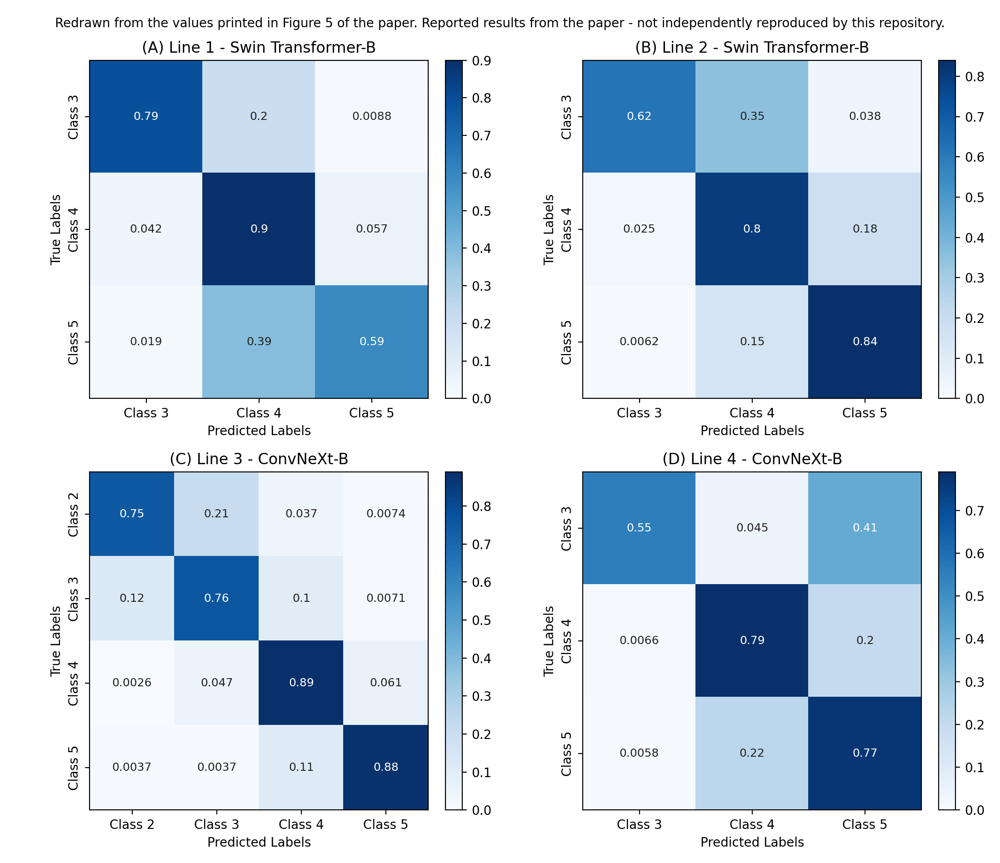

# Comprehensive plant health monitoring: expert-level assessment with spatio-temporal image data

Official implementation for

> Fuentes A.\*, Asgher S.A.\*, Dong J., Jeong Y., Lee M.H., Kim T., Yoon S., Park D.S. (2025).
> **Comprehensive plant health monitoring: expert-level assessment with spatio-temporal image data.**
> *Frontiers in Plant Science* 16:1511651. [doi:10.3389/fpls.2025.1511651](https://doi.org/10.3389/fpls.2025.1511651)
> (\* equal contribution)

> **Status of this repository.** This repository contains the complete code for the experiments in the paper. It also contains the numbers reported in the paper, stored in `results/`. **Those numbers were transcribed from the paper; they were not produced by running this code.** No model has been trained with this repository, so it does not claim to reproduce the paper's results.

---

## Overview

Plant monitoring by manual inspection is slow and labour-intensive, and it often misses early stress. This work proposes a deep-learning framework that rates the **health of individual tomato plants on a five-level expert scale** (1 = very poor … 5 = optimal) from RGB images. Each plant is rated **every week of the cultivation cycle**, and the ratings are combined into spatio-temporal health maps.

- **Data:** 12,119 expert-annotated images of 200 tomato plants (3 varieties, 4 greenhouse lines, 2022), taken weekly from 3 viewpoints.
- **Models:** ImageNet-pretrained VGG-16, ResNet-18, ViT-B/16, Swin-B and ConvNeXt-B, fine-tuned per cultivation line.
- **Best models:** Swin Transformer-B (Lines 1–2) and ConvNeXt-B (Lines 3–4). The best validation F1-score ranges from 0.74 to 0.82.
- **Generalisation:** with a plant-based split (test plants never seen in training), test accuracy is 0.765–0.805. Health trajectories of unseen plants agree with the expert in 83% of cases.

```
 weekly multi-view images of plant P at time t        shared feature extractor         plant state head
 {I_t^left, I_t^right, I_t^top}  ──►  F_t^i  ──►  φ(F_t^i)  (CNN / Transformer)  ──►  S_t = f( ⊕_i φ(F_t^i) ) ∈ {1..5}
                                                                                           │
                                            S_t for t = 1..T  ──►  spatio-temporal health map of every plant
```

## Repository structure

```
plant-health-monitoring/
├── main.py                        # train one (line, model, split) + evaluate the best checkpoint
├── configs/
│   ├── default.yaml               # all hyper-parameters, each tagged [PAPER] or [ASSUMPTION]
│   └── models.yaml                # the 5 architectures (timm ids, input sizes)
├── plant_health/                  # library code
│   ├── data/                      # annotation loading, class filtering, splits, dataset, transforms
│   ├── models/builder.py          # model construction, feature extraction, Grad-CAM target layers
│   ├── engine/                    # training loop, warm-up+cosine scheduler, early stopping, evaluation
│   ├── analysis/                  # Grad-CAM, multi-view aggregation for S_t (Eq. 1)
│   ├── metrics.py                 # accuracy, precision, recall, F1, confusion matrix (Eqs. 2-5)
│   ├── plotting.py                # figure helpers (Figs. 5-11)
│   └── utils/                     # config handling, seeding, I/O
├── scripts/
│   ├── prepare_splits.py          # class filtering + 80:20 random and 70:20:10 plant splits
│   ├── run_table6.sh              # Experiment 1: 5 models × 4 lines   (Tables 6-7, Fig. 5)
│   ├── run_table8.sh              # Experiment 2: plant-based split     (Table 8, Fig. 10)
│   ├── evaluate.py                # evaluate any checkpoint
│   ├── tsne.py                    # Fig. 6
│   ├── gradcam.py                 # Figs. 7-8
│   ├── qualitative_examples.py    # Fig. 9
│   ├── temporal_monitoring.py     # Sec. 4.2 / Fig. 10 (83% agreement)
│   ├── plot_expert_trajectories.py# Fig. 11
│   ├── collect_results.py         # compare your runs with the paper's numbers
│   └── export_reported_tables.py  # paper numbers (JSON) -> CSV / LaTeX tables, Fig. 5 redraw
├── data/README.md                 # dataset description, access, expected layout
├── results/
│   ├── paper_results/reported_results.json   # all numbers reported in the paper
│   ├── tables/                    # Tables 1, 3, 4, 6, 7, 8 and Fig. 5 values (CSV + LaTeX)
│   ├── figures/                   # Fig. 5 redrawn from printed values; notes on other figures
│   └── reproduced/                # empty; filled by scripts/collect_results.py after you train
└── tests/                         # unit tests (synthetic data, no training)
```

The layout follows [YijinHuang/pytorch-classification](https://github.com/YijinHuang/pytorch-classification): one YAML config with command-line overrides, a builder per component (data / model), and `main.py` as the entry point. The dataset, models, training settings and experiments follow the paper.

## Dataset

| | |
|---|---|
| Name | Spatio-temporal tomato plant health dataset (custom) |
| Source | Fruit Vegetable Research Institute, Buyeo, Korea; semi-open greenhouses, 2022 |
| Size | 12,119 images, 200 plants, 4 cultivation lines (Table 1, Table 3) |
| Labels | Expert health level 1–5 (Table 2) |
| Access | **Not public.** Request it from afuentes@jbnu.ac.kr |

Place the images under `data/images/` and create `data/annotations.csv` with the columns `image_path, line, plant_id, week, view, health_level`. See [`data/README.md`](data/README.md) for the full specification.

## Installation

```bash
git clone https://github.com/<your-account>/plant-health-monitoring.git
cd plant-health-monitoring
conda create -n planthealth python=3.8 -y
conda activate planthealth
# the paper used PyTorch 1.10.1 + CUDA 11.3
pip install torch==1.10.1+cu113 torchvision==0.11.2+cu113 -f https://download.pytorch.org/whl/cu113/torch_stable.html
pip install -r requirements.txt
pytest tests/          # quick sanity checks, no GPU or data needed
```

## Pre-processing

```bash
python scripts/prepare_splits.py
```

The script removes under-represented classes per line (≤ 30 images; Sec. 3.1.1). It then writes the image-level 80:20 splits (`data/splits/random/`) and the plant-level 70:20:10 splits (`data/splits/plant/`). It also saves the class distribution of your data, so you can compare it with Table 3.

Pre-processing inside the data loaders follows Sec. 3.1.3:
- mean/std normalisation;
- resizing to 224 × 224 for VGG-16, ResNet-18, ViT and ConvNeXt, and 384 × 384 for Swin;
- rotation ± 20°, horizontal flip and random crop;
- CutMix and Mixup, with label smoothing 0.1.

## Training

One run trains one architecture on one cultivation line:

```bash
python main.py --line 1 --model swin_b     --split random
python main.py --line 3 --model convnext_b --split random
python main.py --line 2 --model vgg16      --split random --opts train.epochs=50 train.num_workers=4
```

`--model` is one of `vgg16`, `resnet18`, `vit_b`, `swin_b`, `convnext_b`. Outputs are written to `runs/line<k>_<model>_<split>/`:
- `best_validation_weights.pt`, `final_weights.pt`, `history.json`, TensorBoard logs;
- `eval/metrics_*.json`, `eval/per_class_*.csv`, `eval/predictions_*.csv`;
- `summary.json`.

Training settings (Table 5, Sec. 3.1.2):

| Setting | Value |
|---|---|
| Initialisation | ImageNet pre-trained, new FC head, all layers trainable |
| Optimizer | AdamW, weight decay 8e-2 |
| Learning rate | Warm-up to 3e-6, then cosine annealing to 1e-6 |
| Loss | Categorical cross-entropy with SoftMax output |
| Batch size | 32 |
| Model selection | Best validation F1, with early stopping |

## Evaluation

```bash
python scripts/evaluate.py --line 1 --model swin_b --split random \
    --checkpoint runs/line1_swin_b_random/best_validation_weights.pt --subset val --plot
```

This reports:
- accuracy, and macro precision, recall and F1 (Eqs. 2–5);
- per-class metrics (Table 7);
- raw and row-normalised confusion matrices (Figure 5);
- per-image predictions.

## Experiments

| # | Experiment (paper section) | Command |
|---|---|---|
| 1 | Five architectures × four lines, random 80:20 split (Sec. 3.2, **Tables 6-7**, Fig. 5) | `bash scripts/run_table6.sh` |
| 2 | Plant-based 70:20:10 split with the best model per line (Sec. 4.1, **Table 8**) | `bash scripts/run_table8.sh` |
| 3 | Spatio-temporal diagrams for unseen plants, agreement with expert (Sec. 4.2, **Fig. 10**) | run automatically by `run_table8.sh` (`scripts/temporal_monitoring.py`) |
| 4 | t-SNE of learned features (Sec. 3.4, **Fig. 6**) | `python scripts/tsne.py --line L --model M --split random --checkpoint ...` |
| 5 | Grad-CAM (Sec. 3.5, **Figs. 7-8**) | `python scripts/gradcam.py --line L --model M --split random --checkpoint ... [--select misclassified]` |
| 6 | Qualitative predictions (Sec. 3.6, **Fig. 9**) | `python scripts/qualitative_examples.py --predictions runs/.../eval/predictions_val.csv` |
| 7 | Expert health trajectories of all plants (Sec. 4.3, **Fig. 11**) | `python scripts/plot_expert_trajectories.py` |

## Results

> **Reported results from the paper — not independently reproduced by this repository.**
> Machine-readable copies: [`results/paper_results/reported_results.json`](results/paper_results/reported_results.json) and [`results/tables/`](results/tables).

### Table 6 — performance across datasets (random 80:20 split)

| Dataset | Architecture | Train Acc. | Val. Acc. | Precision | Recall | F1 |
|---|---|---:|---:|---:|---:|---:|
| Line 1 (Nonari-Cherry) | VGG-16 | 0.852 | 0.809 | 0.75 | 0.74 | 0.75 |
| | ResNet 18 | 0.866 | 0.807 | 0.76 | 0.71 | 0.73 |
| | **Swin Transformer-B** | **0.891** | **0.837** | **0.81** | **0.76** | **0.78** |
| | VIT-B | 0.845 | 0.794 | 0.77 | 0.69 | 0.72 |
| | ConvNeXt-B | 0.887 | 0.813 | 0.77 | 0.71 | 0.74 |
| Line 2 (Amos Coli) | VGG-16 | 0.760 | 0.725 | 0.67 | 0.55 | 0.57 |
| | ResNet 18 | 0.793 | 0.751 | 0.72 | 0.66 | 0.68 |
| | **Swin Transformer-B** | **0.858** | **0.812** | **0.80** | **0.75** | **0.77** |
| | VIT-B | 0.708 | 0.6498 | 0.68 | 0.66 | 0.65 |
| | ConvNeXt-B | 0.847 | 0.789 | 0.77 | 0.74 | 0.76 |
| Line 3 (Amos Coli) | VGG-16 | 0.763 | 0.743 | 0.75 | 0.75 | 0.75 |
| | ResNet 18 | 0.829 | 0.801 | 0.78 | 0.77 | 0.77 |
| | Swin Transformer-B | 0.864 | 0.839 | 0.81 | 0.81 | 0.81 |
| | VIT-B | 0.736 | 0.680 | 0.67 | 0.67 | 0.66 |
| | **ConvNeXt-B** | **0.872** | **0.846** | **0.82** | **0.82** | **0.82** |
| Line 4 (Dafnis-Hybrid) | VGG-16 | 0.838 | 0.794 | 0.77 | 0.70 | 0.73 |
| | ResNet 18 | 0.875 | 0.806 | 0.86 | 0.67 | 0.71 |
| | Swin Transformer-B | 0.830 | 0.772 | 0.79 | 0.62 | 0.66 |
| | VIT-B | 0.782 | 0.683 | 0.64 | 0.68 | 0.66 |
| | **ConvNeXt-B** | **0.892** | **0.783** | **0.79** | **0.70** | **0.74** |

### Table 7 — class-wise performance of the best model per line

| Dataset | Class | Precision | Recall | F1 |
|---|---|---:|---:|---:|
| Line 1 (Swin-B) | Class 3 | 0.90 | 0.84 | 0.79 |
| | Class 4 | 0.81 | 0.88 | 0.86 |
| | Class 5 | 0.70 | 0.59 | 0.64 |
| Line 2 (Swin-B) | Class 3 | 0.79 | 0.62 | 0.69 |
| | Class 4 | 0.80 | 0.80 | 0.80 |
| | Class 5 | 0.80 | 0.84 | 0.82 |
| Line 3 (ConvNeXt-B) | Class 2 | 0.73 | 0.75 | 0.74 |
| | Class 3 | 0.82 | 0.76 | 0.79 |
| | Class 4 | 0.84 | 0.89 | 0.86 |
| | Class 5 | 0.90 | 0.88 | 0.89 |
| Line 4 (ConvNeXt-B) | Class 3 | 0.86 | 0.55 | 0.67 |
| | Class 4 | 0.75 | 0.79 | 0.77 |
| | Class 5 | 0.77 | 0.77 | 0.77 |

### Table 8 — plant-based partitioning (70% / 20% / 10% of plants)

| Dataset | Architecture | Train Acc. | Val. Acc. | Test Acc. |
|---|---|---:|---:|---:|
| Line 1 | Swin Transformer-B | 0.903 | 0.804 | 0.790 |
| Line 2 | Swin Transformer-B | 0.836 | 0.797 | 0.779 |
| Line 3 | ConvNeXt-B | 0.871 | 0.827 | 0.805 |
| Line 4 | ConvNeXt-B | 0.845 | 0.774 | 0.765 |

### Spatio-temporal agreement (Sec. 4.2)

On plants not included in training, predicted health status matched the expert labels in **83%** of cases.

### Figure 5 — confusion matrices (redrawn from the printed values)



## Reproducing the experiments

```
Request dataset ─► data/images + data/annotations.csv
        │
        ▼
python scripts/prepare_splits.py              (class filtering, 80:20 and 70:20:10 splits)
        │
        ▼
bash scripts/run_table6.sh                    (20 training runs → Tables 6-7, Fig. 5)
bash scripts/run_table8.sh                    (4 runs + temporal analysis → Table 8, Fig. 10)
        │
        ▼
scripts/tsne.py, gradcam.py, qualitative_examples.py, plot_expert_trajectories.py  (Figs. 6-9, 11)
        │
        ▼
python scripts/collect_results.py --split random|plant   (your numbers next to the paper's)
```

Hardware used in the paper: one NVIDIA GeForce RTX 3090 (24 GB). Swin-B at 384 × 384 with batch size 32 needs close to that memory.

### Settings not specified in the paper

The following settings are not given in the paper. Each is exposed in `configs/default.yaml` and marked `[ASSUMPTION]`; set them to your original values if they differ. They are the likely source of small deviations from the reported numbers.

| Setting | Default here |
|---|---|
| Maximum epochs / early-stopping patience | 100 / 10 epochs on validation F1 |
| Warm-up length / start factor | 5 epochs / 0.01 × LR |
| Mixup α / CutMix α / switch probability | 0.8 / 1.0 / 0.5 (timm defaults) |
| Random-crop scale, flip probability | [0.8, 1.0], 0.5 |
| Normalisation statistics | ImageNet mean/std |
| ConvNeXt-B input size | 224 × 224 |
| Swin-B checkpoint | `swin_base_patch4_window12_384`. The paper states 7 × 7 windows and 384 × 384 input; the public 384-input Swin-B checkpoint uses 12 × 12 windows. Change it in `configs/models.yaml` |
| Averaging of precision/recall/F1 | macro |
| Class filtering threshold | drop classes with ≤ 30 images (consistent with Fig. 5C) |
| Random split | stratified by class, seed 42 |
| Multi-view aggregation for S_t (Eq. 1) | mean of SoftMax probabilities over the views |
| "Training Accuracy" | best checkpoint re-evaluated on the training images without augmentation |

## Citation

```bibtex
@article{fuentes2025comprehensive,
  title   = {Comprehensive plant health monitoring: expert-level assessment with spatio-temporal image data},
  author  = {Fuentes, Alvaro and Asgher, Syed Ali and Dong, Jiuqing and Jeong, Yongchae and Lee, Mun Haeng and Kim, Taehyun and Yoon, Sook and Park, Dong Sun},
  journal = {Frontiers in Plant Science},
  volume  = {16},
  pages   = {1511651},
  year    = {2025},
  doi     = {10.3389/fpls.2025.1511651}
}
```

## Acknowledgements

The code organisation is adapted from [pytorch-classification](https://github.com/YijinHuang/pytorch-classification) by Yijin Huang. The backbones come from [timm](https://github.com/huggingface/pytorch-image-models). The research was supported by the NRF of Korea (RS-2019-NR040079, RS-2024-00360581) and by IITP (IITP-2025-RS-2024-00439292).

## License

Choose a license before publishing (for example MIT, as used by the reference repository). The paper itself is published under CC BY 4.0.
